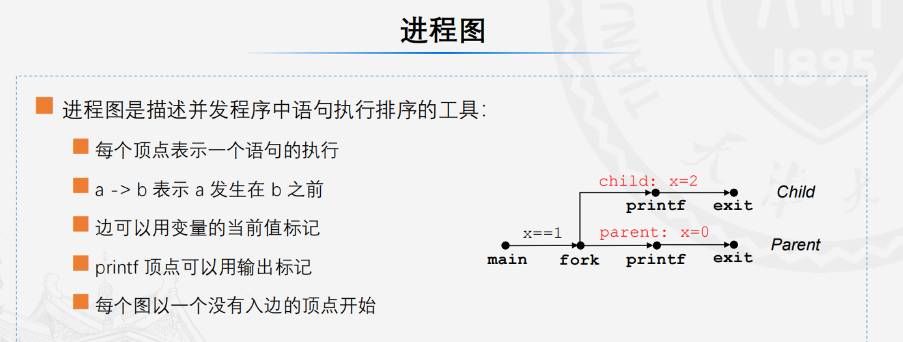
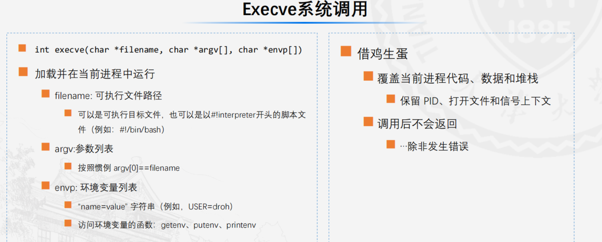
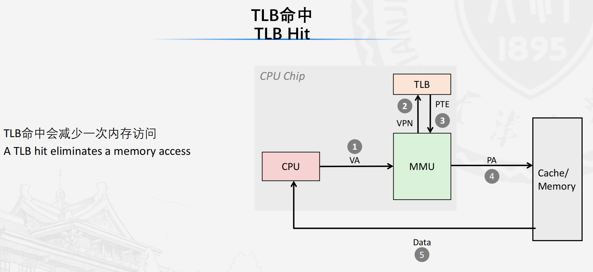
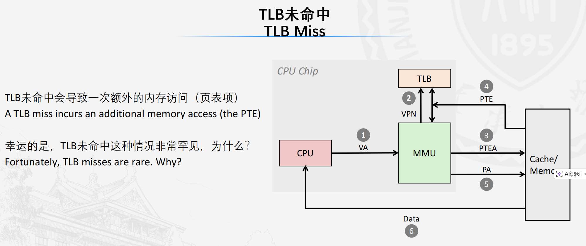
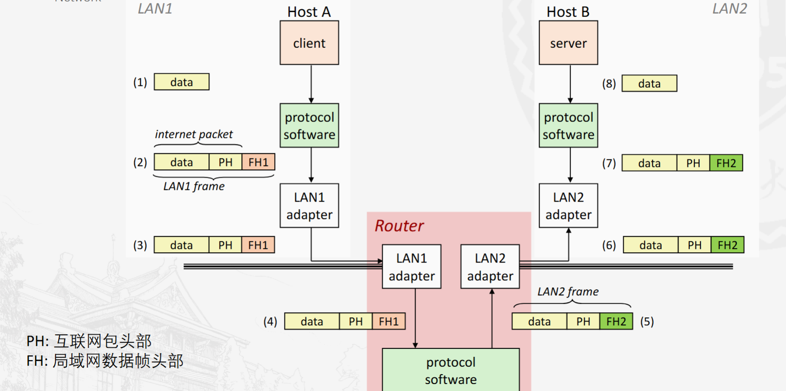

# 8.异常控制流

## 8.1异常

改变控制流

- 跳转和分支（if while goto)  

- 过程调用和返回（return)  

反应的都是程序状态的改变，不能反映系统状态变化。需要异常控制流

#### 异常控制流：

- 底层机制是异常：通过改变控制流以响应系统事件，硬件和操作系统相互配合实现

- 更高层次：进程上下文切换  信号  非本地跳转

一个异常是为了响应某个事件（即处理器状态的改变）

示例：除0、算术运算溢出、缺页、i/o请求完成、ctrl+C

> ps:内存和外存的区分：掉电丢失是内存，不丢失是外存。内存外存读取速度差的多

#### 异常表：

每种类型的异常都有一个编号，根据编号查询异常表来获取如何处理该异常

### 8.1.2异常：

汇编语言、指令执行过程中不会被打断，不会从被中断的部分再重新执行。

要么是把指令做完再去处理异常，处理完进行下一条指令；要么指令被打断，处理完异常再重新执行指令；要么是指令就不再执行了

- 异步异常（中断）
  - 由处理器外部事件引起：设置好的处理器中断引脚
  - 时钟中断：每多少时间触发一次中断
  - 外部设备的io中断
    - ctrl + c
    - 磁盘网络的数据包就绪
- 同步异常
  - 陷阱：
    - 有意触发：请操作系统帮你打开一个文件（程序是不能直接控制硬件，必须由操作系统来处理）
    - 系统调用···
    - ==处理完成后返回下一个指令==
  - 故障：
    - 非有意，但有可能恢复
    - ==重新执行当前指令==或终止
    - 所有人不会同时睡觉，每个人就能独占一间宿舍（只有500个宿舍让1000个人没人独占一间宿舍的方法）
  - 终止
    - 非有意，不可恢复
    - 非法指令
    - ==终止当前指令==

异常举例

1. 系统打开文件：==返回下一个指令==
2. 缺页故障：你想摸台灯，把你打晕，把台灯放到你面前，叫醒你让你摸。==重新执行当前指令==
3. 无效内存引用：==直接杀死==

进程可以自己控制的是内存和cpu

# 异常类型详细分类表

| 异常大类     | 具体类型           | 产生原因                                                     | 处理方式                                                     | 处理结果                                                     | 应用场景示例                                                 |
| ------------ | ------------------ | ------------------------------------------------------------ | ------------------------------------------------------------ | ------------------------------------------------------------ | ------------------------------------------------------------ |
| **异步异常** | 中断（Interrupts） | 处理器外部的事件（与当前执行指令无关），通过处理器中断引脚触发 | 1. 硬件触发中断信号；<br>2. 内核保存当前进程上下文；<br>3. 执行对应中断处理函数；<br>4. 恢复上下文，切换回用户模式 | 返回到当前指令的“下一条指令”继续执行，不影响原程序逻辑       | 1. 时钟中断：内核调度进程，实现多任务并发；<br>2. I/O中断：键盘输入Ctrl-C、磁盘读取完成、网络数据包到达；<br>3. 外设状态通知：打印机完成打印、鼠标移动 |
| **同步异常** | 陷阱（Traps）      | 执行指令时有意触发的异常（程序主动请求）                     | 1. 程序执行特殊指令（如syscall）；<br>2. 内核查找异常表，执行对应陷阱处理函数；<br>3. 处理完成后恢复程序状态 | 返回到当前指令的“下一条指令”继续执行，实现特定功能调用       | 1. 系统调用：open（打开文件）、read（读取数据）、fork（创建进程）等；<br>2. 断点调试：调试器设置断点触发陷阱；<br>3. 特殊指令执行：触发内核提供的服务 |
|              | 故障（Faults）     | 执行指令时非有意触发，但可能恢复的异常（多与内存访问相关）   | 1. 触发故障异常，内核执行故障处理函数；<br>2. 可恢复场景：修复故障（如加载内存页）；<br>3. 不可恢复场景：触发信号或终止程序 | 可恢复：重新执行触发故障的“当前指令”；<br>不可恢复：终止当前程序 | 1. 可恢复：缺页故障（访问的内存页在磁盘，内核加载后重试）；<br>2. 不可恢复：无效内存引用（数组越界）、保护故障（访问内核内存），触发SIGSEGV信号 |
|              | 终止（Aborts）     | 执行指令时非有意触发，且完全不可恢复的严重异常（硬件或指令级致命错误） | 内核执行终止处理函数，无法修复故障                           | 直接终止当前程序，释放资源，无返回值                         | 1. 非法指令（执行CPU不支持的指令）；<br>2. 硬件错误（内存奇偶校验错、CPU故障）；<br>3. 严重内核错误（无法恢复的系统异常） |

## 8.2进程

###  进程：

### 一个进程是一个正在运行的程序的实例（动态的）

进程可以视作有一块cpu（自认为独占）有一块内存（无限大的、独享）

- 逻辑控制流
  - 看上去每一个程序都独占cpu，是由每个进程轮流使用cpu实现
- 私有地址空间
  - 看上去每个程序独占主存空间，由虚拟内存机制实现

### 并发：


这一段时间内ABC正在并发执行，从更高视角看他们是轮流使用

并行是真正的同时进行

#### 上下文切换：你正在运行 想摸不存在的台灯 保存现场 把你打晕 干别的事（送台灯，让别人先运行着） 恢复现场  把你叫醒


#### 用户模式和内核模式

- 用户模式

  - 不能运行特权指令、

  - 不能引用地址空间中内核区的代码和数据 

- 内核模式

  - 没有限制

  - 通过异常，用户模式可以转换为内核模式

错觉：每个人独占cpu，独占内存

## 8.3进程控制

### 8.3.1处理系统调用的错误

操作系统提供的功能函数是小写，csapp本书作者进行包装成可以输出错误信息的大写函数

void unix_error()

### 8.3.2获取进程id

getpid(void) 获取当前进程的id getppid(void)获取父进程id

linux：每个进程都是有父进程fork出来的，谁生出来的谁收尸，即父亲为儿子收尸

### 8.3.3创建和终止进程

#### 进程的状态

- 运行中（running ready）  正在执行，或等待执行，并最终由内核调度
- 停止(blocked ) 执行被暂停
- 终止  
  - 收到终止信号
  - 从main返回
  - 调用exit,正常返回0

父进程被杀死时，会同时杀死它的子进程，孙子进程（就是杀掉一整颗进程树）

父进程将死，子进程不想死，子进程会被托孤给init进程，ppid改为1

#### Fork函数

- 创建进程：父进程调用fork创建新的子进程
- 子进程几乎与父进程相同，pid不同
  - 子进程获得父进程虚拟地址空间相同的一份副本（是独立的）
  - 子进程获得与父进程任何打开==文件描述符==相同的副本

- fork调用一次，返回两次  返回值：
  - 1:(>0)是父亲

  - 0 是儿子

  - -1：创建失败
- ==并发执行：无法预测父子进程的执行顺序==
- 相同但是独立的地址空间（他们对各自数据的改变是独立的）

> [!IMPORTANT]
>
> - [x] 这里需要能够分析出fork函数的输出，哪些是可能的，哪些是不可能的结果                                                                                                                                                                                                                                                                                                                                                                                                                                                                                                                                                                                                                                                                                                                                                                                                                                                                                                                                                                                                                                                                                                                                                                                                                                                                                                                                                                                                                                                                                                                                                                                                                                                                                                                                                                                                                                                                                                                                                                                                                                                                                                                                                                                                                                                                                                                                                                                                                                                                                                                                                                                                                                                                                                                                                                                                                                                                                                                                                                                                                                                                                                                                                                                                                                                                                                                                                                                                                                                                                                                                                                                                                                                                                                                                                                                                                                                                                                                                                                                                                                                                                                                                                                                                                                                                                                                                                                                                                                                                                                                        
>
>
> 方法：画进程图
>
> 

### 8.3.4回收进程

- 进程终止后，未被回收前仍消耗系统资源，被称为僵死进程
- 回收
  - 父进程使用wait()  waitpid()回收子进程
  - 父进程获得退出状态信息
  - 内核删除僵尸子进程
- 父进程不回收
  - 由init进程回收（pid==1）

#### wait(int *child_status)：

- 挂起当前进程,等待儿子(之一)死
- 返回值是终止子进程的pid
- 返回值包含子进程是怎么死的

#### waitpid(pid_t pid, int *status, int options)

- 等待某个特定的进程死亡
- 可以控制收尸的顺序
- 判定等待集合的成员：
  - pid>0, 等待集合就是自己
  - pid=-1,父进程所有的子进程组                                                                                                                                        


### 8.3.5进程休眠

sleep(int sec) 休眠特定时间，

- 正常完成休眠返回0
- 休眠时间未完成，返回未完成休眠的时间

pause() 休眠直到被打断

c语言里面输出的语句：

```c
unsigned int Sleep(int sec){
    unsigned int rc = sleep(sec);
    printf("Slept for %d of %d secs.\n", sec-rc, sec);
}
```


### 8.3.6加载并运行程序

execve()通常没有返回，只有出现错误才可能有返回




## 8.4信号和非本地跳转

### 8.4.1命令解释器

进程会形成一个树状结构

#### shell程序

是一个死循环，一直在等待命令，解释命令，执行命令

有前台运行，后台运行，后台睡觉

### 8.4.2信号

信号是一个简短的消息，通知进程系统中发生两万某种类型的事件

==9号信号不可以被重写被忽略==（一共有两个 ）

#### 发送信号

##### 进程组

- int getpgid(int pid)返回当前的进程组
- int setpgid(int pid, int pgid)设置或改变进程组
  - 把进程pid的进程组pgid;
  - 如果pid=0,就改当前进程的pgid;
  - 如果pgid=0，就创建一个新的进程组，进程组id就是参数里面pid指定进程的pid

##### 使用/bin/kill发送信号

- /bin/kill程序可以给进程发信号
- 使用例子：/bin/kill-9 24819  -24818（给该进程组发送） 0（给调用进程发送）

##### 从键盘发送信号（linux）

ctrl+C杀死（终止进程）  ctrl+z 放到后台（停止进程）

##### kill函数发送信号

int kill(pid_t pid, int sig)成功就返回0，错误就返回-1；

- pid>0,kill()发送信号号码sig给进程pid
- pid=0,kill()发送信号sig给调用进程所在进程组中的每个进程包括调用进程自己
- pid<0,kill()发送sig给|pid|进程组中的每个进程

#### 接受信号（忽略，终止，捕获等）                                                             

挂起和阻塞：

- 挂起状态:一个信号已发送但尚未接受，则该信号处于挂起状态
- 每种类型的信号最多只能有一个挂起的信号
- 信号不排队，如果已经有了一个k挂起信号，后续的k信号将被丢弃
- 不可以计数同一个信号来了几次，仅仅是一个标志位


#### 处理信号（终止暂停忽略）

signal函数重写信号指令，signal(int sigint,handler handler)，不可以修改sigkill

#### 信号的阻塞


##### 阻塞和解除阻塞信号int sigprocmask()

#### 安全的信号处理

处理程序中只调用异步信号安全的函数

##### 非本地跳转

setjmp（jmp_buf j）

- 必须在longjmp之前调用
- 作为longjmp返回的锚点
- 仅调用一次，可以返回多次

longjmp（jmp_buf j,int i）

- 返回至setjmp存储的j所在位置，i作为跳转过去的setjmp的返回值
- 再setjmp之后调用
- 仅调用一次不会返回

# 9.虚拟内存

每个进程都有自己的虚拟地址空间   

## 9.1地址空间

线性地址空间:连续的 

虚拟地址空间总大小：N=2^n个虚拟地址所构成的集合，n是虚拟地址位数

物理地址空间总大小：M=2^m物理地址空间构成的集合,m数物理地址位数

物理地址空间与虚拟地址空间没有约束性关系


SRAM比DRAM快

### 9.1.1虚拟内存作为缓存工具

- 虚拟内存是一个包含N个连续字节的数组，可以被存储在磁盘上
- 磁盘上的数组被缓存在物理内存中

页表是一个页表项数组，用于建立虚拟页到物理页的映射

- 页命中：此时所引用的虚拟内存数据(虚拟页)恰好存储在物理内存中
- 缺页：此时所引用的虚拟内存数据(虚拟页)没有存储在物理内存中

页未命中会引发缺页故障异常

> [!IMPORTANT]
>
> **运行一条指令的过程**
>
> - [x] 查页表-缺页-处理完成-重新执行指令-查页表-访问

局部性原理：程序运行时总是频繁访问一小部分活跃虚拟页（称为工作集），不会同时访问所有虚拟页

工作集<主存容量，系统性能会比较好

==抖动：页面可能会出现连续的换入换出(缺页故障)，这会导致性能下降==（正常使用不会出现）

### 9.1.2虚拟内存作为内存管理的工具

- 共享数据/代码，例如dll链接库

- 简化内存分配：你需要的内存可以是连续的虚拟地址映射到零散的物理页
- 简化程序加载：即懒加载，翻到哪一页加载哪一页，不必加载全部，节省时间空间

核心思想：每个进程都拥有属于它们自己的虚拟地址空间

### 9.1.3虚拟内存作为内存保护的工具

PTE中增加权限位，控制进程对虚拟页的访问权限

## 9.2地址翻译

使用页表翻译地址，虚拟地址翻译为物理地址

程序需要访问数据，程序员编写时是用的是虚拟地址，需要在页表中找到对应的物理地址，才能拿到数据，所以需要地址转换

1. ### **利用页表翻译**
- 虚拟地址VA 分成两段，VPN虚拟页号和VPO虚拟页偏移量,使用虚拟页号作为偏移量在页表中查找物理页号，如果命中（V=1）就取出(PPN)与物理页偏移量(PPO)组合，形成物理地址(PA)

- 虚拟地址位数为n，VPO(0-p-1)，VPN(p-n-1)   1KB=2^10

- 只翻译页号，复用页内偏移

- 页表：内核为每个进程维护的VPN-PPN对照表，存储在DRAM中，每个PTE包含3个关键信息：

  - 有效位：1/0
  - 物理页号：虚拟页对应的物理页编号
  - 权限位：读写执行权限

- 

- ###### 页命中（Page Hit）

  **概念**：虚拟页已缓存到 DRAM（PTE 有效位 = 1），翻译流程无中断，直接获取物理地址。

  **流程 + 示例**（PDF 页命中流程）：

  1. CPU 发送虚拟地址（如 0x0310）到 MMU；
  2. MMU 拆分 VPN=0x03、VPO=0x10；
  3. MMU 查页表，找到 PTE（Valid=1，PPN=0x02）；
  4. 拼接物理地址 = 0x0210，发送到缓存 / DRAM；
  5. 缓存 / DRAM 返回数据到 CPU—— 全程无中断，速度快（DRAM 访问约 100ns）


   - 如果缺页，异常处理程序选择一个页换出，将新页加载至内存更新PTE,之后返回==重新==执行指令

   - ###### 缺页（Page Fault）

     **概念**：虚拟页未缓存到 DRAM（PTE 有效位 = 0），触发 “缺页异常”，内核需将磁盘上的虚拟页加载到 DRAM 后，重新执行访问指令。

     **流程 + 示例**（PDF 缺页流程）：

     1. CPU 发送虚拟地址（如 0x0120）到 MMU；
     2. MMU 查页表，发现 PTE（Valid=0，VPN=0x01）；
     3. MMU 触发缺页异常，内核接管；
     4. 内核选择 “受害者物理页”（如 PPN=0x0D，若为脏页则写回磁盘）；
     5. 从磁盘读取 VPN=0x01 的虚拟页数据，加载到 PPN=0x0D；
     6. 更新页表：将 VPN=0x01 映射到 PPN=0x0D，Valid 设为 1；
     7. ==重启==原指令，此时页命中，正常翻译地址。
2. ### 利用TLB翻译

  TLB存储在SRAM中，而页表存储在DRAM中，使用TLB可大幅加速

  TLB 按 “组相联” 组织，虚拟地址的 VPN 拆分为 “TLB 标记（TLBT）+ TLB 组索引（TLBI）”：

  - TLBI：选择 TLB 中的组，长度为t，由p---p+t-1；
  - TLBT：匹配组内的条目，找到对应的 PPN。

  TLB命中会减少一次内存访问

  

  

  **TLB 未命中**：若 TLB 中无对应映射（如 VPN=0x08），MMU 会先查 DRAM 中的页表获取 PPN，再将 “VPN→PPN” 映射存入 TLB，下次访问即可命中。因为程序有局部性（频繁访问少量虚拟页），TLB 未命中概率极低。

3. ### 多级页表 

64 位系统虚拟地址空间极大（如 48 位对应 256TB），若用单级页表，需存储海量 PTE（例：48 位地址 + 4KB 页 + 8 字节 PTE→需 512GB 页表)，根本无法存入 DRAM。多级页表的核心是 “只加载活跃的页表部分”，按层级拆分 VPN，逐级索引。

> [!IMPORTANT]
>
> - [x] 重点：根据虚拟内存找出vpn,vpo,TLBI,TLBT再在快表中查PPN,然后找出CO,CI,CT

## 9.3内存映射

内存映射中，可以将不同的虚拟内存映射给相同的物理内存

#####  内存映射（Memory Mapping）：虚拟内存的 “初始化方式”

**概念**：内存映射是将虚拟内存区域与磁盘对象关联，初始化虚拟页数据的方式，分为两类：

- 文件映射（File-backed）：虚拟页数据来自磁盘文件（如可执行文件、共享库）；
- 匿名映射（Anonymous）：虚拟页无对应文件，首次缺页时分配全 0 物理页（如堆、栈）。

##### （1）共享映射与私有映射

- 共享映射（MAP_SHARED）：多个进程的虚拟页映射到同一物理页，修改会同步到磁盘文件 —— 适合进程间共享数据；
- 私有映射（MAP_PRIVATE）：默认 “写时复制（COW）”，多个进程共用物理页，任一进程修改时，内核为其复制新物理页，不影响其他进程。

**示例 1：共享库映射**：`libc.so`（C 标准库）通过共享映射加载到多个进程的虚拟地址空间，所有进程的虚拟页映射到同一物理页 ——DRAM 仅存一份`libc.so`代码，节省内存。

**示例 2：写时复制（COW）与 fork**：`fork()`创建子进程时，内核不复制父进程的物理页，而是：

1. 复制父进程的页表、vm_area_struct；

2. 将所有 PTE 标记为只读；

3. 将所有虚拟区域标记为 “私有 COW”；

   当子进程修改某虚拟页时，触发保护异常，内核为子进程复制新物理页，更新页表 —— 这样 fork 速度极快，仅复制少量元数据。

##### （2）用户级内存映射函数：mmap

**概念**：用户程序通过`mmap`系统调用创建内存映射，函数原型：

```
void *mmap(void *start, int len, int prot, int flags, int fd, int offset);
```

- start：建议映射地址（0 表示内核分配）；
- len：映射长度；
- prot：访问权限（PROT_READ = 读，PROT_WRITE = 写）；
- flags：映射类型（MAP_ANONYMOUS = 匿名映射，MAP_PRIVATE = 私有映射）；
- fd：文件描述符（文件映射时使用）；
- offset：文件偏移量（文件映射时，从文件该位置开始映射）。

**示例**：`mmapcopy`函数 —— 用 mmap 复制文件到 stdout：

```
void mmapcopy(int fd, int size) {
    char *bufp = Mmap(NULL, size, PROT_READ, MAP_PRIVATE, fd, 0);
    Write(1, bufp, size); // 直接访问映射区域，无需用户空间缓存
}
```

原理：将文件映射到进程虚拟地址空间，`Write`时直接访问虚拟地址，MMU 自动翻译为物理地址（缺页时加载文件数据），无需额外分配用户空间缓冲区，效率极高。

### 4. Linux 的缺页故障处理

Linux 将缺页分为 3 类，都通过 “异常处理” 机制处理：

- 正常缺页：虚拟页存在但未缓存（如首次访问堆内存）→ 内核分配物理页，加载数据；
- 段错误（Segmentation fault）：访问不存在的虚拟页（如 VPN=0x1000，页表中无对应 PTE）→ 内核终止进程；
- 保护故障：违反权限（如向只读页写入）→ 内核也报告为段错误。

**示例**：你写的 C 程序`*(int *)0x12345678 = 10;`（访问非法虚拟地址），Linux 页表中无该 VPN 的 PTE，触发段错误，程序崩溃并输出 “Segmentation fault”。

## 9.4动态内存分配

所有的函数相关的都与栈有关

动态内存，想用就用，不想用不用

- ##### （1）`malloc`函数

  - 原型：`void *malloc(size_t size)`

  - 说明：

    - 成功：返回指向至少`size`字节的内存块指针，地址按 8 字节（x86）或 16 字节（x86-64）对齐（保证数据访问效率）；
    - 失败：返回`NULL`，并设置`errno`（错误码）；
    - 特殊情况：`size=0`时返回`NULL`。

  - 示例：

    ```
    int *p = (int *)malloc(4 * sizeof(int));
    ```

    申请 4 个int大小（16 字节）的内存块，指针p指向该块起始虚拟地址。

  ##### （2）`free`函数

  - 原型：`void free(void *p)`

  - 说明：将`p`指向的已分配块归还给堆的空闲内存池，`p`必须是`malloc`/`realloc`返回的有效指针，不可重复释放或释放无效指针。

  - 示例：

    ```
    free(p);
    ```

    释放p指向的 16 字节内存，该块变为空闲块，后续可被重新分配。

  #### （3）其他辅助函数

  - `calloc`：`malloc`的变体，分配后自动将内存块初始化为 0；
  - `realloc`：修改已分配块的大小（扩大时可能迁移数据）；
  - `sbrk`：分配器内部使用，用于向内核申请扩展堆或收缩堆。


分配器的性能指标是吞吐量和峰值内存利用率

内部碎片：有效载荷＜块大小

外部碎片：堆中总空闲内存足够满足请求，但没有单个连续的空闲块能适配

如何跟踪空闲块：

1. 隐式空闲链表，使用包含块长度的头部信息，以连接所有块

   双字对齐（对8对齐 ）

   - 首次适配算法

   - 下次适配算法

   - 最佳适配

   回收的方法：

   - 清除已分配标志
   - 边界标记
     - 双向链表，已分配不要尾巴，未分配加上尾巴

2. 显式空闲链表，在空闲块之间使用指针连接

   空闲块放指针

3. 分离的空闲链表

## 9.5垃圾回收

自动回收==堆==分配的存储空间，应用程序无需手动释放 

# 10.系统级io

## 10.1 Unix I/O

creat正确版本（create错误）

任何行为想读写文件都必须使用操作系统提供的读写

读：read()把文件数据复制到内存，写write()把内存数据放到文件里

lseek()改变当前游标

read(fd,buf,sizeof(buf))从fd中取数据存到buf中，返回从文件fd读取到buf中的字节数

- 返回类型ssize是有符号整数
- 返回值＜0表示发生了错误
- 短计数（nbytes<sizeof(buf)）是可能的，且不是错误

write()

本书作者提出一个RIO包（断点续传

无缓冲版：

- readn(fd, buf, sizeof(buf))

有缓冲版：用缓冲区存用户可能会用到的数据，就是替用户预读

rio_readlined()从文件fd中读取最多maxlen的文本行

rio_readlineb()只读一行，一个字负一个字符的读，读到换行就break；


在内核中如何表示已打开的文件

 描述符表：

> [!IMPORTANT]
>
> ==fd1,fd2同时打开一个文件，游标各是各的；fork之后，父子共用一个游标==

dup2(4,1)把fd1引用的文件指向fd4指向的文件，游标也变成了fd4

### 标准io

fopen fclose fread fwrite fgets fputs fscanf fprintf  自带缓冲区

缓冲区被输出的时机：'/n' fflush(),满了，return 0,调用exit()

stderr有缓冲，stdout没缓冲

如何选择


# 11.网络编程

## 11.1客户端-服务器模型


## 11.2网络

几个网络层次

- 以太网端
  - 每个主机的网卡有唯一的48位MAC地址z
  - 通过电缆连接到集线器
  - 数据以帧进行传输
  - ==广播==:集线器会将每个端口的数据复制到其他端口上，每个主机都能看到数据，接受不接收随你
  - 覆盖一个房间或一个楼层

- 桥接以太网段
  - 使用电缆和网桥将多个以太网段连接成一个较大的局域网
  - 覆盖一个建筑或一个校园
  - ==选择性转发帧，只发给目标主机==

- 局域网：覆盖一个建筑,即桥接以太网段
- 广域网：
  - 覆盖一个国家
  - 多个局域网通过路由器连接起来，称为广域网

- 互联网：
  - 多个不兼容的LAN,WAN通过路由器互联组成的网络系统
  - 数据以数据包为单位传输
  - 采用临时互联的方式组织，没有特定的拓扑结构，不同的数据包可能走不同路线


**互联网协议**

如何在不兼容的LANWAN上发送数据呢？

在每台主机和路由器上运行协议软件，解决不同网络的兼容性问题 

- 统一命名方案：标志主机和路由器
- 标准传输单元（数据包）：规范数据的传输格式
  - 数据包包含头部和有效载荷
    - 头部：包含信息，如数据包的大小、源地址和目的地址
    - 有效载荷：包含从源主机发送的数据位



假设 Host A（LAN1，以太网）向 Host B（LAN2，光纤网络）发送数据，流程如下：

1. Host A 的应用程序生成数据；
2. 协议软件将数据封装为互联网数据包（添加 PH，包含源 IP、目的 IP）；
3. 数据包再封装为 LAN1 的以太网帧（添加 FH1，包含 MAC 地址），通过网卡发送到 LAN1；
4. LAN1 的路由器接收帧，剥离 FH1，提取互联网数据包，根据 PH 中的目的 IP 判断路由；
5. 路由器将数据包封装为 LAN2 的帧（添加 FH2，适配光纤网络协议），发送到 LAN2；
6. Host B 接收帧，剥离 FH2 和 PH，提取原始数据并处理。

## 11.3全球IP因特网

TCP/IP协议族

- IP:提供基本的命名方案和不可靠的主机到主机数据报传输，不保证数据不丢失，不重复，按序到达**示例**：你通过 QQ 发送消息，IP 协议负责将消息数据包从你的电脑（源主机）发送到 QQ 服务器（目的主机），但可能因网络拥堵导致部分数据包丢失。
- UDP(不可靠数据报协议)：使用ip提供从进程到进程的不可靠数据报传输，不可靠但是快 **示例**：视频通话中的语音数据传输，UDP 协议将语音数据分成小数据包，快速发送到对方，即使少量数据包丢失，也不会严重影响通话（延迟比可靠性更重要）。
- TCP(传出控制协议/)：基于 IP 协议，提供进程到进程的可靠字节流传输（保证数据无丢失、无重复、按序到达），支持全双工通信。**示例**：文件下载（如通过浏览器下载 PDF），TCP 协议会确保所有文件数据包都按顺序到达，若有数据包丢失，会自动重传，保证文件完整。

ipv4: 32位的二进制数据分为4段，变为十进制

ip地址映射到一串标识符，叫做域名

ipv6使用128位地址

套接字地址：ip:port (80端口即http,443 https)

## 11.2套接字

> [!IMPORTANT]
>
> 重点

常规文件io和套接字io唯一区别是如何打开

通用套接字地址：sockaddr()

sockaddr_in()专用于ipv4


getaddrinfo(host(ip地址或者是域名), port(端口数字或者是名字), hints, result)

socket(int domain,int type,int protocol)返回的是一个句柄

bind()来请求内核将服务器的套接字地址与套接字描述符关联（绑定ip和端口到listen）

listen()告诉内核，描述符将被服务器使用而不是客户端使用（监听有没有消息）

accept()等待客户端的链接请求

封装成

客户端做的事

connect()


先openlistenfd,listenfd一直在等待，客户端openclientfd,然后尝试connect,链接成功会accept,clientfd与connfd成pair,listenfd还在等待新的连接（并发版本）

 

代理proxy是客户端和源服务器之间的中间人

Mmap()映射到内存上

CGI规范


# 12.并发编程

## 12.1

并发编程经典问题；

- 竞争  最后一张票两个人竞争，最后都买到了
- 死锁  交通拥堵
- 活锁  短进程优先导致长进程一直在等待


迭代服务的缺陷是只能运行一个进程，另一个进程只能一直等待

echo（）是客户端与服务器进行通信

实现并发服务的方法

- ==基于进程的方法==：内核自动交错

  为每个客户端创建单独的进程（fork），父进程只进行迎宾（listenfd）需要关闭connectfd，子进程招待（connectfd）关闭listenfd

  ​	优点：同时处理多个连接；很清晰；很简单

  ​	缺点：速度慢，开销大；进程间共享数据实现复杂

- 基于事件的服务：clientfd用了一个数组

  所有的read，accept都是阻塞的

  select(int n,······)听着一堆文件描述符，返回值是有几个到达了
  
  
- 线程

  进程=进程上下文+代码、数据和栈
  
  跟内存（库、堆、代码和数据）相关的是共有的（私有：跟栈相关的（存放形参和局部变量），还有cpu寄存器）
  
  一个进程可以关联多个线程
  
  - 线程有自己的逻辑控制流
  - 共享相同的代码、数据和内核上下文
  - 有自己的栈用于存储本地变量，但不受其他线程保护
  - 有自己的线程id
  - 进程是树状结构，线程之间是平等的
  - 并发并行，并行是真正意义的同时进行

Pthreads:

- 创建和回收：pthread_create()相当于fork(),join()相当于waitpid()

- 获取当前线程id：pthread_self()相当于getpid()

- 终止线程：pthread_cancel相当于kill(),pthread_exit()相当于exit()

  

- 基于线程的服务：

  优点:

  - 线程间共享数据结构十分容易
  - 比进程效率高

  缺点：

  - 很难知道哪些数据是共享的，哪些是私有的
  - 很难通过测试来检测

## 12.2同步


全局和局部静态变量是被共享的

进程图 的轨迹

只允许一个线程进入临界区，访问相同临界资源的临界区互斥

> [!IMPORTANT]
>
> 临界区和临界资源
>
> cnt++是临界区，cnt是临界资源

==信号量Semaphores==，为了同步线程的执行，以便它们永远不会产生不安全的轨迹

- 信号量：非负整数的全局同步变量。通过PV（原语）操作进行操作

  s只能出现在PV中

- P操作（测试，下降）

  - 如果s不为0，则s-1并立即返回
  - 测试和减少操作是原子性的
  - 如果s为0，则挂起线程，直到s变为非0，通过V操作重新启动线程
  - 重新启动后，P操作将减少s并将控制返回给调用者

- V操作（上升）

  - s+1
  - 原子性

Pthread库函数里面，sen_init(),P操作是sem_wait(),V操作sem_post()

用PV操作把临界区包裹起来，互斥型信号量，初值为1

初值＞1，就是计数信号量

> [!IMPORTANT]
>
> ==生产者消费者问题==

生产到仓库，消费者消费，仓库（缓冲区）

一个互斥信号量，两个计数信号量（一个阻塞生产者没货，一个阻塞消费者货满了）

mutex(互斥锁)确保互斥访问

slots:计算缓冲区中可用的插槽数

items:计算缓冲区可用的项目数

==线程可以是多个对多个==，先申请计数信号量，再申请互斥锁，顺序不能颠倒

如果颠倒，先进入临界区，再申请计数信号量，如果申请不到技术信号量，会阻塞线程，发生死锁


线程安全

1. 未保护共享变量

   使用PV信号量操作

2. 多次调用之间保持状态的函数

   依赖静态状态的随机数生成器，解决办法是把状态作为参数的一部分传递，从而消除

3. 返回指向静态变量的指针的函数

   - 重写函数，使调用者传递存储结果的变量地址
   - 2锁定并复制

4. 调用线程不安全的函数

可重入函数不访问共享变量，就是线程安全的 

==竞争==

==死锁==：一个进程在等待一个永远不会成立的条件

部分拥有，期望更多，循环等待


读者-写者问题

